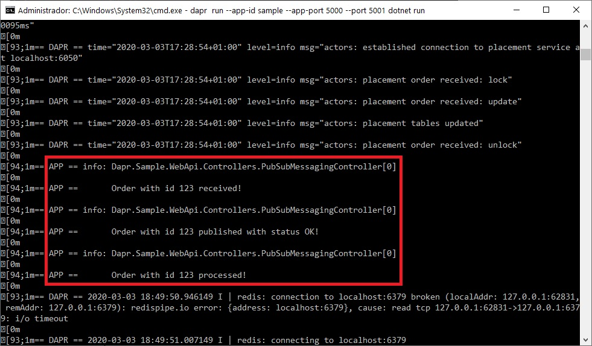
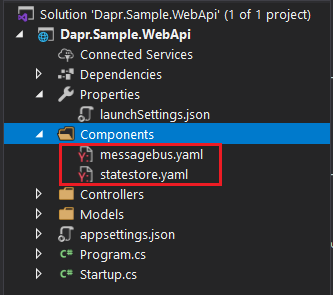

# Dapr.Sample.WebApi

Dapr is an event-driven portable runtime for building micro-services, for more information refer to the [documentation](https://github.com/dapr/docs/). Be aware that Dapr is currently under constant evolution, so some of the code used in the sample could be changed or deprecated in the future.

This sample is based on Dapr version 0.4 and focuses on the ASP.NET core integration for its Service integracion, State management and Publish / Subscribe messaging capabilities.

You can find a Postman collection file to test all these sample cases in the [/Postman](./Postman) directory.

## Service Integration

There is a Hello World sample in the [ServiceInvocationController.cs](./Dapr.Sample.WebApi/Controllers/ServiceInvocationController.cs) file.

### Running the application

To run the sample locally follow these steps:

- Ensure you have all [prerequisites](https://github.com/dapr/docs/blob/master/getting-started/environment-setup.md#prerequisites) configured correctly
- Make sure you are in the project folder
- Install and start Dapr in standalone mode, via the following command

```sh
dapr init
```

- Start the ASP.NET application with the application listening on HTTP port 5000 (default for Kestrel) and the Dapr sidecar on 5001

```powershell
dapr run --app-id sample --app-port 5000 --port 5001 dotnet run
```

Note: The app-id can be anything but you need it to invoke the methods through Dapr.

Now your application should be running on port 5000 while dapr is running on port 5001. You can close the application through Ctrl + C.

### Testing the application

First, to test the application itself:

```powershell
curl http://localhost:5000/hello
```

should show in the same window

```powershell
World
```

and in the dapr running window should show:

```
== APP == Hello, World.
```

### Testing Dapr

Now we can test dapr

```powershell
curl http://localhost:5001/v1.0/invoke/sample/method/hello
```

which should have the same output in both windows.
The *sample* is the dapr app id and *hello* is the topic.

## Pub/Sub messaging

This sample in the [PubSubMessagingController.cs](./Dapr.Sample.WebApi/Controllers/PubSubMessagingController.cs) file is a very basic application that hosts an Order API.  This API publishes a message on a topic and another part of the application is subscribing on it.

### Testing the API

At startup time, Dapr performs a GET to see on what is has to subscribe

```powershell
curl http://localhost:5000/dapr/subscribe
```

 The application should return an array that includes the order topic among others

```txt
["ordertopic","hello","deposit","withdraw"]
```

Now you can trigger the Order API to test the application

```txt
POST http://localhost:5000/api/order
{
   "id" : "123",
   "reference" : "tvh",
   "product" : "laptop",
   "quantity" : 1,
   "price" : 1300.00
}
```

If we analyse the logs, you’ll notice the following entries:

1. The Order API gets invoked on api/order
2. The order was parsed and received successfully
3. The order was published on the ordertopic
4. The Dapr sidecar subscribed on the order and invoked the app on /ordertopic
5. The order was processed

<p>
  
</p>

In case you’re running Dapr standalone and when you didn’t specify any explicit _messagebus_ component, then Dapr will autogenerate component YAML files that interact with the local Redis container that ships with it. In this case, two files were added:

- messagebus.yaml: Redis message bus running locally
- statestore.yaml: Redis state store running locally

<p>
  
</p>

## State Management

There is a simple banking sample in the [StateManagementController.cs](./Dapr.Sample.WebApi/Controllers/StateManagementController.cs) file. The sample uses the Dapr state-store for its data storage.

It exposes the following endpoints over HTTP:

- GET `/{account}`: Get the balance for the account specified by `id`
- POST `/deposit`: Accepts a JSON payload to deposit money to an account
- POST `/withdraw`: Accepts a JSON payload to withdraw money from an account

The application also registers for pub-sub with the `deposit` and `withdraw` topics.

### Examples

**Deposit Money**

 On Windows:

```sh
curl -X POST http://localhost:5000/deposit -H "Content-Type: application/json" -d "{ \"id\": \"17\", \"amount\": 12 }"
```

 Output:

```txt
{"id":"17","balance":12}
```

---

**Withdraw Money**

On Windows:

```sh
curl -X POST http://localhost:5000/withdraw -H "Content-Type: application/json" -d "{ \"id\": \"17\", \"amount\": 10 }"
 ```

Outpt:

```txt
{"id":"17","balance":2}
```

---

**Get Balance**

```sh
curl http://localhost:5000/17
```

Output:

```txt
{"id":"17","balance":2}
```

---

 **Withdraw Money (pubsub)**

Publish events using Dapr cli:

On Windows:

```sh
dapr publish -t withdraw -p "{\"id\": \"17\", \"amount\": 15 }"
```

---

**Deposit Money (pubsub)**

Publish events using Dapr cli:

On Windows:

```sh
dapr publish -t deposit -p "{\"id\": \"17\", \"amount\": 15 }"
```

---

## Debug the application

In case you want to debug the code inside Visual Studio 2019, while it’s running as a Dapr application, you just need attach to the process with the same name than the project inside the list of running processes.
